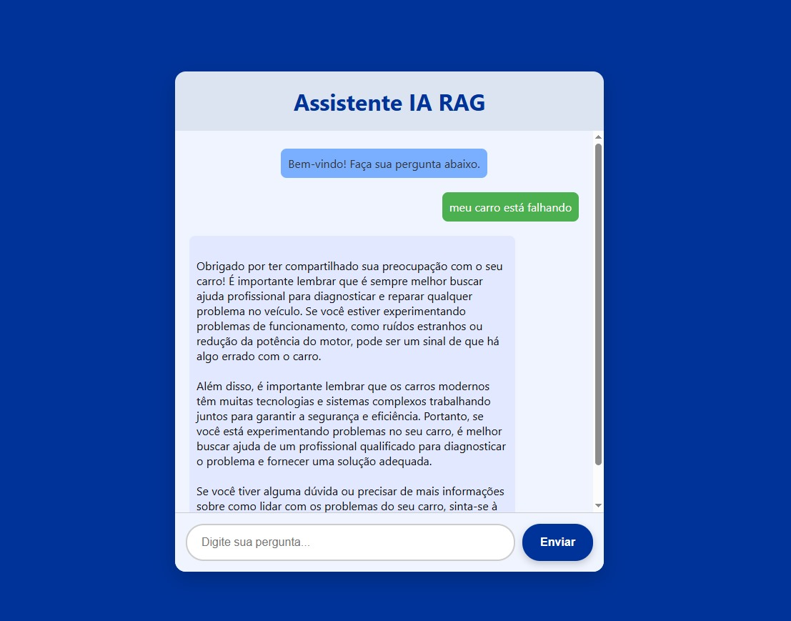

# Assistente IA RAG - Resumo do Projeto

Este projeto é um **assistente baseado em RAG (Retrieval-Augmented Generation)**, que permite consultar documentos em PDF e obter respostas a perguntas relacionadas ao conteúdo.  

---

## Tecnologias e Ferramentas Utilizadas

- **Linguagem:** Python  
- **Framework:** LangChain  
- **Banco de Dados Vetorial:** Chroma (SQLite3)  
- **Modelo de LLM:** GPT4All  
  - ⚠️ Modelo básico, portanto as respostas podem demorar um pouco para serem geradas.  
  - Não foi possível utilizar OpenAI por ser uma solução paga.  

---

## Arquitetura do Sistema

O sistema segue o modelo **RAG**, que combina:  
1. **Recuperação de documentos relevantes** usando embeddings.  
2. **Geração de respostas** baseadas no conteúdo recuperado.  

Isso permite que mesmo com modelos de LLM mais simples, seja possível fornecer informações relevantes extraídas dos PDFs.

---

## Desafios Encontrados

Devido à simplicidade do modelo GPT4All:

- Podem ocorrer **erros nas bibliotecas** ou inconsistências na geração das respostas.  
- O modelo pode ter dificuldade de **identificar exatamente o que o usuário deseja**.  
- A função de **leitura e interpretação de PDFs não funcionou perfeitamente**, pois a IA não conseguia separar as informações corretamente.  
  - Por exemplo: ao pedir uma resposta específica, o modelo retornava **todas as informações de todos os vetores armazenados**, dificultando respostas objetivas.  
- Para contornar essas limitações, foi necessário criar um **sistema de palavras-chave**, ajudando a filtrar os documentos mais relevantes durante a busca.  
- Ajustei o parâmetro `k=3` no retriever para aumentar a precisão das respostas.  
- Para que a função de PDF funcionasse de forma ideal, seria necessário usar um modelo mais potente, como **GPT-4 Mini**, mas este é pago.

---

## Justificativa da Escolha

- O modelo **RAG** se encaixa perfeitamente no objetivo do projeto, permitindo:  
  - Consulta rápida a PDFs e bancos de dados vetoriais.  
  - Combinação de busca precisa com geração de respostas contextualizadas.  

Mesmo com um LLM básico, essa arquitetura garante **respostas mais relevantes e contextualizadas**, mesmo sem acesso a modelos pagos da OpenAI.

---

## Considerações Finais

Este projeto demonstra como é possível construir um **assistente de perguntas e respostas** eficiente utilizando apenas ferramentas gratuitas e open-source, destacando a importância de um **bom sistema de busca (RAG)** para complementar modelos de LLM mais simples.

---

## Visualização do Projeto

### Interface do Assistente

### Arquitetura RAG

[
